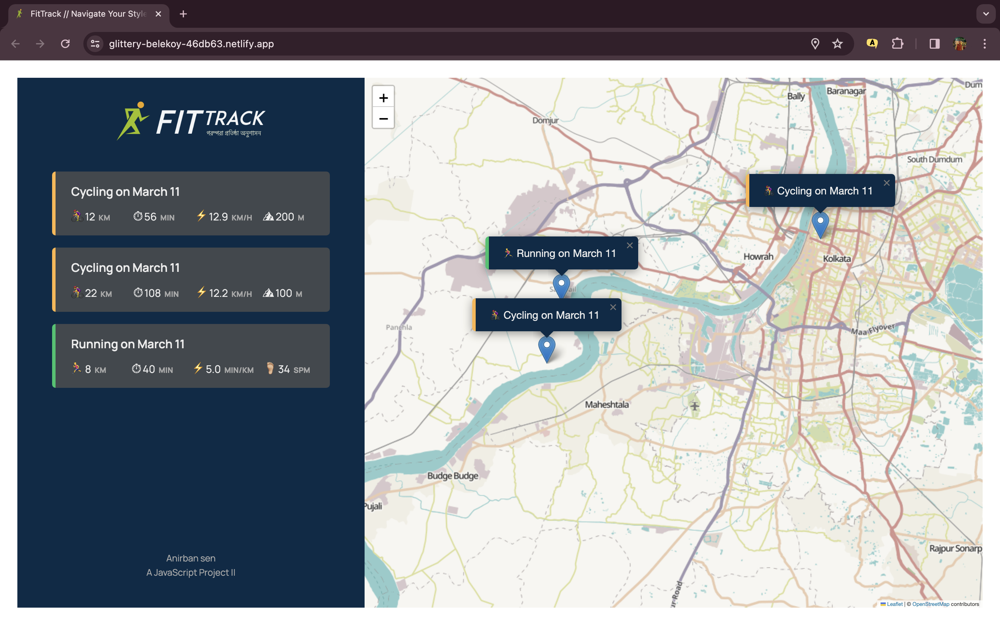

# LIVE SITE
🔗 Live version of this site is available <a href="anirbansen-fittrack.netlify.app" target="_blank">here</a>

# FitTrack
FitTrack || A Fitness Navigator

# FEATURES
👉 Map where user clicks to add new workout (best way to get location coordinates) 

👉 Geolocation to display map at current location (more user friendly) 

👉 Form to input distance, time, pace, steps/minute 

👉 Form to input distance, time, speed, elevation gain 

👉 Display all workouts in a list 

👉 Display all workouts on the map 

👉 Store workout data in the browser using local storage API 

👉 On page load, read the saved data from local storage and display 

# IMAGES
📸 
